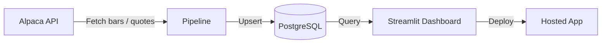

# AI Market Data Pipeline

An end-to-end stock market data pipeline that fetches market data from the [Alpaca API](https://alpaca.markets/), stores it in a remote PostgreSQL database, and surfaces insights through a deployed [Streamlit](https://streamlit.io/) dashboard.

## Overview

This project automates the flow from raw market data to actionable visualization:

1. **Ingest** — Pull historical and/or real-time stock data from Alpaca.
2. **Store** — Persist normalized records in PostgreSQL for querying and analysis.
3. **Visualize** — Explore prices, trends, and summary metrics in an interactive Streamlit app.



## Features

- Automated data ingestion from Alpaca (bars, quotes, or trades depending on configuration)
- Centralized storage in a remote PostgreSQL database
- Idempotent writes to avoid duplicate records on re-runs
- Interactive dashboard for price history, symbol lookup, and market insights
- Environment-based configuration for local development and production deployment

## Tech Stack

| Layer        | Technology                          |
| ------------ | ----------------------------------- |
| Data source  | Alpaca Markets API                  |
| Database     | PostgreSQL (remote / managed)       |
| Pipeline     | Python                              |
| Dashboard    | Streamlit                           |
| Deployment   | Streamlit Community Cloud (or similar) |

## Project Structure

```
ai-market-data-pipeline/
├── README.md
├── requirements.txt          # Python dependencies
├── .env.example              # Template for environment variables
├── pipeline/
│   ├── fetch.py              # Alpaca API client and fetch logic
│   ├── transform.py          # Data cleaning and normalization
│   └── load.py               # PostgreSQL insert / upsert
├── db/
│   └── schema.sql            # Table definitions and indexes
├── dashboard/
│   └── app.py                # Streamlit application
└── scripts/
    └── run_pipeline.py       # Entry point to run ingest end-to-end
```

> Layout may evolve as the codebase is implemented.

## Prerequisites

- **Python 3.10+**
- **Alpaca account** with API key and secret ([sign up](https://app.alpaca.markets/signup))
- **PostgreSQL database** (e.g. Supabase, Neon, RDS, or self-hosted)
- **Streamlit account** for deployment (optional for local development)

## Setup

### 1. Clone the repository

```bash
git clone <repository-url>
cd ai-market-data-pipeline
```

### 2. Create a virtual environment

```bash
python -m venv .venv
source .venv/bin/activate   # Windows: .venv\Scripts\activate
pip install -r requirements.txt
```

### 3. Configure environment variables

Copy the example env file and fill in your credentials:

```bash
cp .env.example .env
```

| Variable              | Description                                      |
| --------------------- | ------------------------------------------------ |
| `ALPACA_API_KEY`      | Alpaca API key ID                                  |
| `ALPACA_SECRET_KEY`   | Alpaca API secret key                              |
| `ALPACA_BASE_URL`     | API base URL (paper: `https://paper-api.alpaca.markets`) |
| `DATABASE_URL`        | PostgreSQL connection string                       |
| `SYMBOLS`             | Comma-separated tickers (e.g. `AAPL,MSFT,GOOGL`)   |

Never commit `.env` or real credentials to version control.

### 4. Initialize the database

Apply the schema to your PostgreSQL instance:

```bash
psql "$DATABASE_URL" -f db/schema.sql
```

## Usage

### Run the data pipeline

Fetch data from Alpaca and load it into PostgreSQL:

```bash
python scripts/run_pipeline.py
```

Schedule this command (e.g. via cron, GitHub Actions, or a cloud scheduler) for recurring updates.

### Run the dashboard locally

```bash
streamlit run dashboard/app.py
```

Open the URL shown in the terminal (typically `http://localhost:8501`).

## Deployment

### Streamlit dashboard

1. Push the repository to GitHub.
2. Connect the repo in [Streamlit Community Cloud](https://streamlit.io/cloud).
3. Set the same environment variables (`DATABASE_URL`, etc.) in the app settings.
4. Deploy `dashboard/app.py` as the main file.

### Pipeline scheduling

Run the ingest script on a schedule so the dashboard always has fresh data. Options include:

- **GitHub Actions** — cron-triggered workflow
- **Cloud scheduler** — AWS EventBridge, GCP Cloud Scheduler, etc.
- **Cron** — on a VM or container with network access to Alpaca and Postgres

## Security Notes

- Store API keys and database credentials in a secrets manager or platform env vars, not in source code.
- Use read-only database credentials for the Streamlit app when possible.
- Prefer TLS-enabled PostgreSQL connections (`sslmode=require` in the connection string).

## License

Add your license here (e.g. MIT, Apache 2.0).
