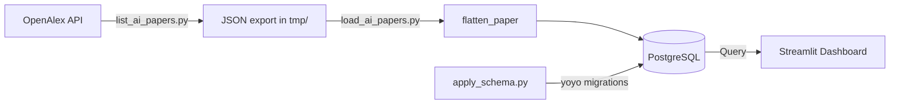

# AI Market Data Pipeline

A Python pipeline that fetches recent Artificial Intelligence research papers from [OpenAlex](https://openalex.org/), stores flattened records in PostgreSQL, and prepares data for a tracking dashboard.

## Overview

The pipeline has three stages:

1. **Fetch** — Query OpenAlex for recent AI papers and save a JSON export to `tmp/`.
2. **Migrate** — Ensure PostgreSQL tables exist via versioned yoyo migrations.
3. **Load** — Flatten nested OpenAlex work objects, deduplicate, and upsert into `ai_papers`.



## Features

- Fetch recent AI papers from OpenAlex by subfield and publication date range
- Flatten nested OpenAlex JSON into a dashboard-friendly PostgreSQL schema
- Automatic schema setup on ingest (only applies pending migrations)
- Two-layer deduplication: within the JSON file and on `openalex_id` in the database
- Idempotent re-runs via `ON CONFLICT DO UPDATE`
- Ingest run history tracked in `paper_ingest_runs`

## Tech Stack

| Layer        | Technology                          |
| ------------ | ----------------------------------- |
| Data source  | OpenAlex API (`pyalex`)             |
| Database     | PostgreSQL (Neon or other managed)  |
| Migrations   | yoyo-migrations                     |
| DB driver    | psycopg 3                           |
| Pipeline     | Python 3.9+                         |
| Dashboard    | Streamlit (planned)                 |

## Project Structure

```
ai-market-data-pipeline/
├── README.md
├── requirements.txt
├── yoyo.ini                         # yoyo migration config
├── db/
│   └── migrations/
│       └── 20260615_01_create_ai_papers.py
├── scripts/
│   ├── list_ai_papers.py            # Fetch papers from OpenAlex → JSON
│   ├── load_ai_papers.py            # Ingest JSON → PostgreSQL
│   ├── apply_schema.py              # Apply pending DB migrations
│   ├── flatten_paper.py             # OpenAlex work → flat row mapper
│   └── db_connection.py             # PostgreSQL connection helpers
└── tmp/                             # JSON exports (gitignored)
```

## Prerequisites

- **Python 3.9+**
- **PostgreSQL database** (e.g. Neon, Supabase, RDS)
- **OpenAlex API key** (optional, but recommended for higher rate limits)

## Setup

### 1. Clone the repository

```bash
git clone <repository-url>
cd ai-market-data-pipeline
```

### 2. Create a virtual environment

```bash
python -m venv .venv
source .venv/bin/activate   # Windows: .venv\Scripts\activate
pip install -r requirements.txt
```

Always use the project venv at `.venv/` for pipeline commands.

### 3. Configure environment variables

Create a `.env` file in the project root:

| Variable           | Description                                           |
| ------------------ | ----------------------------------------------------- |
| `DATABASE_URL`     | Full PostgreSQL connection string (preferred)          |
| `DB_PASSWORD`      | Database password (if `DATABASE_URL` is not set)     |
| `DB_HOST`          | Database host (optional, has Neon default)           |
| `DB_USER`          | Database user (optional, has default)                |
| `DB_NAME`          | Database name (optional, has default)                |
| `OPENALEX_API_KEY` | OpenAlex API key (optional, improves rate limits)    |

Never commit `.env` or real credentials to version control.

### 4. Initialize the database

Apply migrations to create `ai_papers` and `paper_ingest_runs`:

```bash
.venv/bin/python scripts/apply_schema.py
```

Check migration status:

```bash
.venv/bin/python scripts/apply_schema.py --list
```

You do not need to run this manually before every ingest — `load_ai_papers.py` calls `apply_schema()` automatically and only applies pending migrations.

## Usage

### Step 1: Fetch papers from OpenAlex

Fetches recent Artificial Intelligence papers and writes a timestamped JSON file to `tmp/`:

```bash
.venv/bin/python scripts/list_ai_papers.py
```

Output example: `tmp/ai_papers_20260614_192257.json`

The JSON payload includes metadata (`fetched_at`, `date_range`, `subfield`) and a `papers` array of raw OpenAlex work objects.

### Step 2: Load papers into PostgreSQL

Ingest a JSON export into the `ai_papers` table:

```bash
.venv/bin/python scripts/load_ai_papers.py tmp/ai_papers_20260614_192257.json
```

This script:

1. Calls `apply_schema()` to create tables if required
2. Connects to PostgreSQL via `db_connection.connect()`
3. Flattens each paper with `flatten_paper()`
4. Deduplicates records within the JSON file by `openalex_id`
5. Upserts rows into `ai_papers` using `ON CONFLICT (openalex_id) DO UPDATE`
6. Records the run in `paper_ingest_runs`

Example output:

```
Schema already up to date.
Source: tmp/ai_papers_20260614_192257.json
Ingest run id: 1
Upserted 2084 papers
```

Re-running the same file is safe: existing rows are updated, not duplicated.

### Programmatic usage

```python
from pathlib import Path
from load_ai_papers import ingest_from_json

result = ingest_from_json(Path("tmp/ai_papers_20260614_192257.json"))
print(result.upserted, result.duplicates_in_file, result.skipped_invalid)
```

## Database Schema

### `ai_papers`

Flattened paper records for dashboard queries. Key columns:

| Column               | Purpose                                      |
| -------------------- | -------------------------------------------- |
| `openalex_id`        | Primary key (deduplication key)              |
| `title`, `doi`       | Display and linking                          |
| `publication_date`   | Time-series charts                           |
| `primary_topic_name` | Topic breakdown                              |
| `subfield_name`      | AI subfield filter                           |
| `oa_status`, `is_oa` | Open-access analysis                         |
| `cited_by_count`     | Citation metrics                             |
| `source_name`        | Venue / publisher breakdown                  |

### `paper_ingest_runs`

Audit log of each JSON ingest (source date range, subfield, paper count).

### Migrations

Schema changes live in `db/migrations/` as yoyo migration files. To add a new migration, create a file such as:

```
db/migrations/20260620_02_add_column.py
```

Each file defines `steps = [step(apply_sql, rollback_sql)]`.

## Deduplication

| Layer              | Where                         | Behaviour                                      |
| ------------------ | ----------------------------- | ---------------------------------------------- |
| Within JSON file   | `load_ai_papers.prepare_rows` | Skips duplicate `openalex_id` in the same file |
| Database           | `ai_papers` primary key       | `ON CONFLICT DO UPDATE` on re-ingest           |

## Security Notes

- Store database credentials in a secrets manager or platform env vars, not in source code.
- Use read-only database credentials for the Streamlit dashboard when possible.
- Prefer TLS-enabled PostgreSQL connections (`sslmode=require` in the connection string).
- Do not commit `.env` files containing passwords.

## License

Add your license here (e.g. MIT, Apache 2.0).
